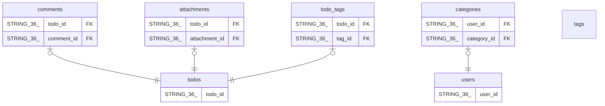

# projects/test-project/instances/test-instance/databases/todo-db

## Tables

| Name | Columns | Comment | Type |
| ---- | ------- | ------- | ---- |
| [comments](comments.md) | 5 |  | BASIC TABLE |
| [users](users.md) | 5 |  | BASIC TABLE |
| [attachments](attachments.md) | 8 |  | BASIC TABLE |
| [categories](categories.md) | 5 |  | BASIC TABLE |
| [tags](tags.md) | 3 |  | BASIC TABLE |
| [todos](todos.md) | 11 |  | BASIC TABLE |
| [todo_tags](todo_tags.md) | 3 |  | BASIC TABLE |

## Relations

---

> Generated by [tbls](https://github.com/k1LoW/tbls)
