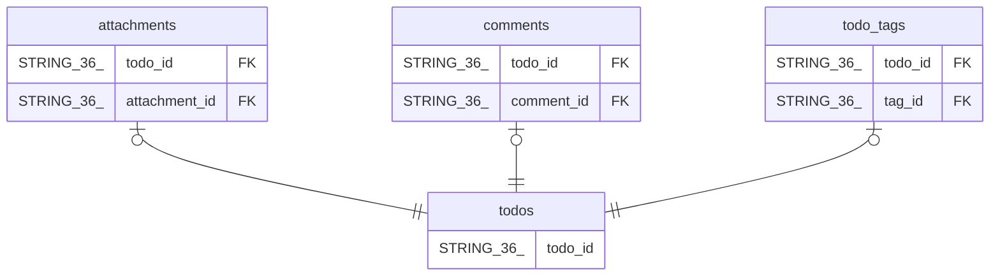

# attachments

## Description

## Columns

| Name | Type | Default | Nullable | Children | Parents | Comment |
| ---- | ---- | ------- | -------- | -------- | ------- | ------- |
| todo_id | STRING(36) |  | false |  | [todos](todos.md) |  |
| attachment_id | STRING(36) |  | false |  | [todos](todos.md) |  |
| user_id | STRING(36) |  | false |  |  |  |
| filename | STRING(255) |  | false |  |  |  |
| file_size | INT64 |  | false |  |  |  |
| mime_type | STRING(100) |  | false |  |  |  |
| storage_path | STRING(500) |  | false |  |  |  |
| uploaded_at | TIMESTAMP (allow_commit_timestamp=TRUE) |  | false |  |  |  |

## Constraints

| Name | Type | Definition |
| ---- | ---- | ---------- |
| PRIMARY_KEY | PRIMARY_KEY | PRIMARY KEY(todo_id, attachment_id) |
| INTERLEAVE | INTERLEAVE | INTERLEAVE IN PARENT todos ON DELETE CASCADE |

## Indexes

| Name | Definition |
| ---- | ---------- |
| IDX_attachments_user_id_4C7D73049CFAC993 | CREATE INDEX IDX_attachments_user_id_4C7D73049CFAC993 ON attachments (user_id) |

## Relations

---

> Generated by [tbls](https://github.com/k1LoW/tbls)
