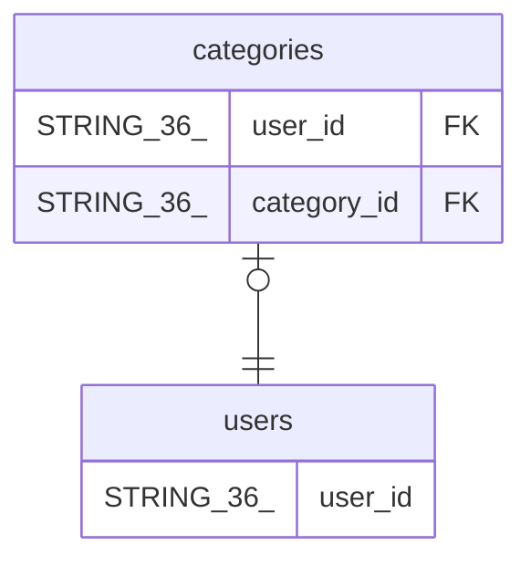

# categories

## Description

## Columns

| Name | Type | Default | Nullable | Children | Parents | Comment |
| ---- | ---- | ------- | -------- | -------- | ------- | ------- |
| user_id | STRING(36) |  | false |  | [users](users.md) |  |
| category_id | STRING(36) |  | false |  | [users](users.md) |  |
| name | STRING(100) |  | false |  |  |  |
| color | STRING(7) |  | true |  |  |  |
| created_at | TIMESTAMP (allow_commit_timestamp=TRUE) |  | false |  |  |  |

## Constraints

| Name | Type | Definition |
| ---- | ---- | ---------- |
| PRIMARY_KEY | PRIMARY_KEY | PRIMARY KEY(user_id, category_id) |
| INTERLEAVE | INTERLEAVE | INTERLEAVE IN PARENT users ON DELETE CASCADE |

## Indexes

| Name | Definition |
| ---- | ---------- |
| IDX_categories_category_id_U_BC14739FA19E28EE | CREATE UNIQUE INDEX IDX_categories_category_id_U_BC14739FA19E28EE ON categories (category_id) |

## Relations

---

> Generated by [tbls](https://github.com/k1LoW/tbls)
