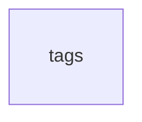

# tags

## Description

## Columns

| Name | Type | Default | Nullable | Children | Parents | Comment |
| ---- | ---- | ------- | -------- | -------- | ------- | ------- |
| tag_id | STRING(36) |  | false |  |  |  |
| name | STRING(50) |  | false |  |  |  |
| created_at | TIMESTAMP (allow_commit_timestamp=TRUE) |  | false |  |  |  |

## Constraints

| Name | Type | Definition |
| ---- | ---- | ---------- |
| PRIMARY_KEY | PRIMARY_KEY | PRIMARY KEY(tag_id) |

## Indexes

| Name | Definition |
| ---- | ---------- |
| idx_tags_name | CREATE UNIQUE INDEX idx_tags_name ON tags (name) |

## Relations

---

> Generated by [tbls](https://github.com/k1LoW/tbls)
