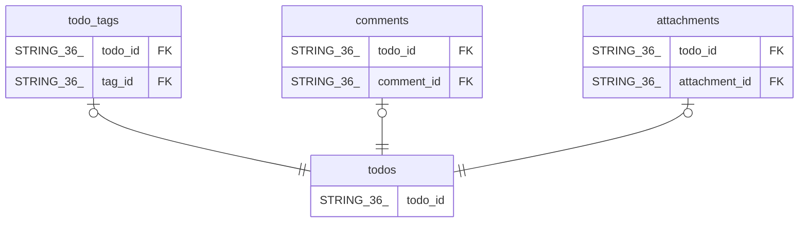

# todo_tags

## Description

## Columns

| Name | Type | Default | Nullable | Children | Parents | Comment |
| ---- | ---- | ------- | -------- | -------- | ------- | ------- |
| todo_id | STRING(36) |  | false |  | [todos](todos.md) |  |
| tag_id | STRING(36) |  | false |  | [todos](todos.md) |  |
| created_at | TIMESTAMP (allow_commit_timestamp=TRUE) |  | false |  |  |  |

## Constraints

| Name | Type | Definition |
| ---- | ---- | ---------- |
| PRIMARY_KEY | PRIMARY_KEY | PRIMARY KEY(todo_id, tag_id) |
| INTERLEAVE | INTERLEAVE | INTERLEAVE IN PARENT todos ON DELETE CASCADE |

## Indexes

| Name | Definition |
| ---- | ---------- |
| IDX_todo_tags_tag_id_8034AADD17A5A521 | CREATE INDEX IDX_todo_tags_tag_id_8034AADD17A5A521 ON todo_tags (tag_id) |

## Relations

---

> Generated by [tbls](https://github.com/k1LoW/tbls)
