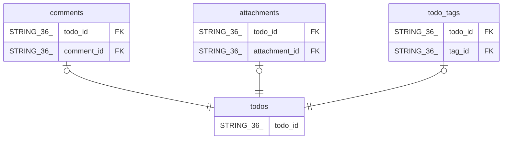

# todos

## Description

## Columns

| Name | Type | Default | Nullable | Children | Parents | Comment |
| ---- | ---- | ------- | -------- | -------- | ------- | ------- |
| todo_id | STRING(36) |  | false | [comments](comments.md) [attachments](attachments.md) [todo_tags](todo_tags.md) |  |  |
| user_id | STRING(36) |  | false |  |  |  |
| category_id | STRING(36) |  | true |  |  |  |
| title | STRING(255) |  | false |  |  |  |
| description | STRING(MAX) |  | true |  |  |  |
| status | STRING(20) |  | false |  |  |  |
| priority | STRING(10) |  | false |  |  |  |
| due_date | DATE |  | true |  |  |  |
| created_at | TIMESTAMP (allow_commit_timestamp=TRUE) |  | false |  |  |  |
| updated_at | TIMESTAMP (allow_commit_timestamp=TRUE) |  | false |  |  |  |
| completed_at | TIMESTAMP |  | true |  |  |  |

## Constraints

| Name | Type | Definition |
| ---- | ---- | ---------- |
| PRIMARY_KEY | PRIMARY_KEY | PRIMARY KEY(todo_id) |

## Indexes

| Name | Definition |
| ---- | ---------- |
| idx_todos_due_date | CREATE INDEX idx_todos_due_date ON todos (due_date) |
| IDX_todos_user_id_4E872528DC8BBCA7 | CREATE INDEX IDX_todos_user_id_4E872528DC8BBCA7 ON todos (user_id) |
| IDX_todos_category_id_N_3B7864FE3ED3FF87 | CREATE NULL_FILTERED INDEX IDX_todos_category_id_N_3B7864FE3ED3FF87 ON todos (category_id) |
| idx_todos_user_status | CREATE INDEX idx_todos_user_status ON todos (user_id, status) |

## Relations

---

> Generated by [tbls](https://github.com/k1LoW/tbls)
