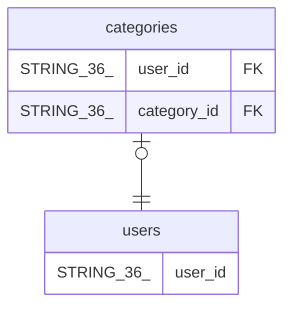

# users

## Description

## Columns

| Name | Type | Default | Nullable | Children | Parents | Comment |
| ---- | ---- | ------- | -------- | -------- | ------- | ------- |
| user_id | STRING(36) |  | false | [categories](categories.md) |  |  |
| email | STRING(255) |  | false |  |  |  |
| username | STRING(100) |  | false |  |  |  |
| created_at | TIMESTAMP (allow_commit_timestamp=TRUE) |  | false |  |  |  |
| updated_at | TIMESTAMP (allow_commit_timestamp=TRUE) |  | false |  |  |  |

## Constraints

| Name | Type | Definition |
| ---- | ---- | ---------- |
| PRIMARY_KEY | PRIMARY_KEY | PRIMARY KEY(user_id) |

## Indexes

| Name | Definition |
| ---- | ---------- |
| idx_users_email | CREATE UNIQUE INDEX idx_users_email ON users (email) |

## Relations

---

> Generated by [tbls](https://github.com/k1LoW/tbls)
